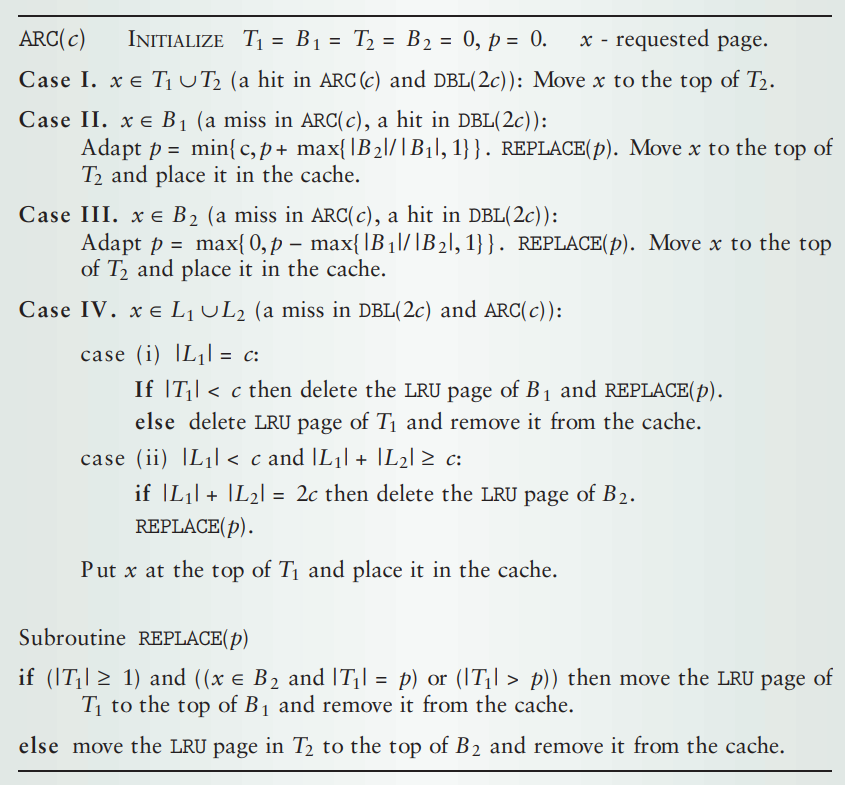
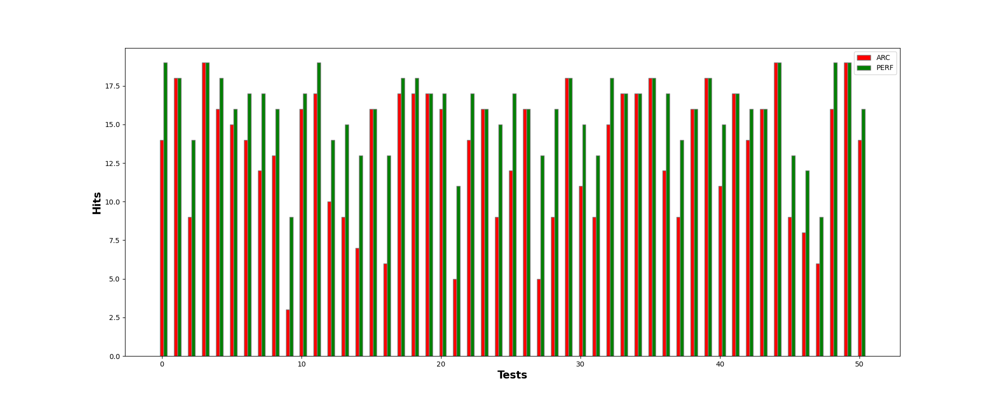

# ARC-Algorithm   
###  ARC - Adaptive Replacement Cache Algorithm   
ARC works relying on two types of data: most frequently used and  last recently used. So it also keeps information of pages that has been already removed from the cache to make predictions.   
    
### Install and Run   
To make and run a program:   
```
make
./arc
```
**Input:** first number - cache size; second - number of pages; next - pages (consider key = page).   
**Output:**  number of hits.   
To **delete** executable run: `make clean
`   
### Tests   
Tests were written with a help of [GoogleTest](https://google.github.io/googletest/) ([here](https://habr.com/ru/articles/667880/) is how to install it and make a basic tests).    
To make and run tests:   
```
make tests
./runtests
```
By default filename is "data_30_2000.txt" and Ntests = 100
To run tests with parameters -f filename  -n number of tests:   
```
./runtests -f filename -n Ntests
```
To create data for tests:   
```
cd arc_in_py
python main.py -f filename -n Ntests
```
By default filename is "data.txt" and Ntests = 2000
To **delete** tests run: `make tclean`    
### ARC and perfect cache comparison
Let's assume we know what pages we gonna get. And according to this information we delete from the cache pages that will be used the latest.
So I run the same data in ARC and perfect cache algorithms and according to the results draw a bar chart shown below.
We can see that perfect cache indeed hits better than ARC. But in some cases they have the same or at least almost the same results.
    
### Links   
For more information about ARC follow: [https://www.andrew.cmu.edu/course/15-440/assets/READINGS/megiddo-computer2004.pdf](https://www.andrew.cmu.edu/course/15-440/assets/READINGS/megiddo-computer2004.pdf)    
   
